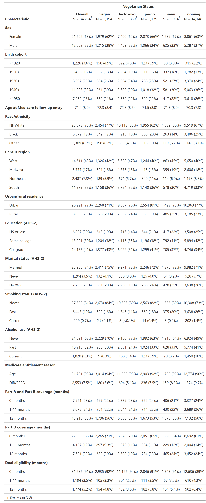
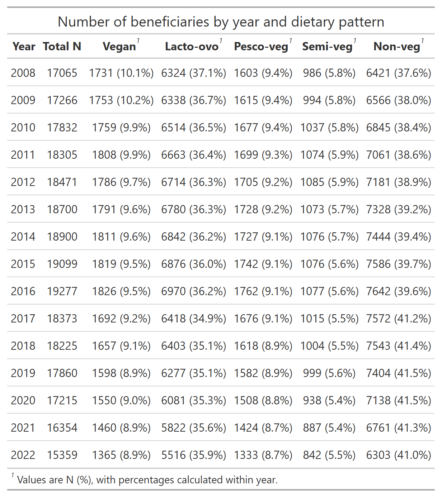

Diet and healthcare cost/utilization
================

## Aim

- To compare healthcare expenditure among five dietary groups of AHS-2
  and Medicare fee‑for‑service enrollees

## Datasets

- Medicare data, 2008-2022

  - For details on the Medicare data, see the [AHS-2 Medicare
    Linkage](https://github.com/keijioda/ahs_medicare_linkage/blob/main/summary.md)
    repository

  - Master Beneficiary Summary File (MBSF), 2008-2022

    - See [Data
      documentation](https://resdac.org/cms-data/files/mbsf-base/data-documentation)
    - Contains beneficiary characteristics and enrollment/eligibility
      information

  - MBSF Cost and Use (CU), 2008-2022

    - See [Data
      documentation](https://resdac.org/cms-data/files/mbsf-cost-and-use/data-documentation)
      - See also [Baik et al. (2024), Trends in Racial Disparities in
        Healthcare Expenditures Among Senior Medicare Fee-for-service
        Enrollees in
        2007-2020](https://pubmed.ncbi.nlm.nih.gov/37957537/)
    - Contains payments made by Medicare, the beneficiary, and primary
      payers for services covered under Parts A, B, and D

  - Together, the two files cover 463,648 person-years, representing
    46,897 distinct beneficiaries/participants, after excluding:

    - Gender/DOB mismatch with AHS-2 data
    - Duplicate beneficiary IDs and SSNs

  - For a full list of variable used in this analysis, see the [analysis
    outline](outline.md)

- AHS-2 Baseline questionnaire (not imputed), including n = 96,114
  participants

- After merging Medicare and AHS-2 data, there were n = 46,687
  participants

  - Participants who opted out from the study (n = 162) and those who
    live outside the U.S. (n = 50) were further excluded, yielding n =
    46,475 participants (459,660 person-years)

## Outcomes

- Total FFS expenditure: Beneficiary + Medicare + Primary (+ Per diem if
  available), i.e., All Part A + Part B
- Part A, Part B, and Part D separately?

## Exposure of interest

- Five dietary patterns derived from AHS-2 baseline questionnaire
  - Assumes that dietary patterns remained stable throughout follow-up

## Inclusion-exclusion criteria

- Starting from 459,660 person-years, we excluded:
  - Person-years before the beneficiary turned 65
    - Resulted in 436,425 person-years from 45,076 distinct IDs
  - Person-years with any month of Medicare Advantage enrollment
    - Resulted in 281,197 person-years from 35,864 distinct IDs
  - Person-years residing in a US territory
    - Resulted in 281,146 person-years from 35,859 distinct IDs
  - Those with missing covariate values
    - Resulted in 268,301 person-years from 34,254 distinct IDs

## Descriptive tables

### Participant characteristics at Medicare follow-up entry

- The table below shows participant characteristics measured either at
  Medicare follow-up entry (2008-2022) or, for variables drawn from the
  AHS-2 questionnaire, at AHS-2 baseline. [Download table as
  PDF](results/descriptive_table.pdf)
  - The variable `Age at Medicare follow-up entry` refers to the
    beneficiary’s age at their first appearance in Medicare data
    (2008-2022)
  - Race/ethnicity was derived from the [RTI race
    code](https://resdac.org/cms-data/variables/research-triangle-institute-rti-race-code)
    in the MBSF and collapsed into 3 groups: Non-Hispanic White, Black
    (or African-American), and other race. Non-Hispanic White served as
    the reference group in the model
  - Census region was derived from `STATE_CODE` in the MBSF (West as the
    reference)
  - Urban/rural residence was derived from the monthly state/county FIPS
    codes (`STATE_CNTY_FIPS_CD_01` through `STATE_CNTY_FIPS_CD_12`);
    when more than one FIPS code appeared within a year, the most
    frequently occurring one was used. Each FIPS code was then mapped to
    a [USDA Rural-Urban Continuum
    Code](https://www.ers.usda.gov/data-products/rural-urban-continuum-codes)
    using the `rurality` package (version 0.1.1) and collapsed into a
    binary urban/rural indicator:
    - Urban: codes 1-3 (metro counties, ranging from ≥1 million
      population down to under 250,000), served as the reference
    - Rural: codes 4-9 (nonmetro counties, ranging from 20,000 or more
      urban population down to under 5,000)
  - Medicare entitlement reason was derived from [the original reason
    for
    entitlement](https://resdac.org/cms-data/variables/medicare-original-reason-entitlement-code-orec)
    `MDCR_OREC`, and collapsed into two
    - Old age & survivor’s insurance (reference)
    - Disability insurance benefit (DIB) and/or end-stage renal disease
      (ESRD)
  - The variable `Part A and Part B coverage (months)` was calculated as
    the minimum of total Part A and Part B coverage months in the year.
    This assumes the two coverage periods overlap fully, which holds for
    nearly all beneficiaries in this cohort

### Number of beneficiaries by years and diet pattern

- See below for the number of beneficiaries by year and dietary pattern.
  [Download table as PDF](results/n_beneficiaries_by_year_diet.pdf)

- All diet groups show growth through roughly 2016, then decline
  thereafter

<!-- -->

### Summary statistics of total healthcare payment

- Total healthcare payment was adjusted for inflation using the [CPI for
  medical care](https://fred.stlouisfed.org/series/cpimedsl)
  - Each year’s payments were multiplied by a deflator equal to the
    ratio of the 2022 index value to that year’s index value
- Summary statistics of total healthcare payment by dietary group are
  shown below, with all dollar values expressed in real (2022) dollars.
  [Download table as PDF](results/cost_summary_total_incl_zero.pdf)
  - Vegans have the highest proportion of zero-payment beneficiary-years
    (20.3%) and have the lowest mean/median total payment
  - Vegans show the highest Gini coefficient (0.770), indicating the
    most unequal spending distribution among all diet groups
  - Spending is highly concentrated at the top across all groups
    - The top 5% of beneficiary-years account for 40–44% of total
      spending, and
    - The top 1% account for 14–17%
    - Vegans again showing the highest concentration (44.4% and 16.5%,
      respectively)
  - Despite having the lowest mean spending, vegans show the greatest
    relative inequality in spending

- The same statistics were calculated again after excluding
  beneficiary-years of zero payments. [Download table as
  PDF](results/cost_summary_total_excl_zero.pdf). After excluding
  zero-payment years:
  - Mean and median payments rise substantially for all diet groups
    - The Gini coefficients dropped as well
    - Spending concentration at the top remains high but is somewhat
      less extreme
  - Vegans retain the highest spending concentration among users
    (highest Gini, highest top 5%/1% shares)
    - suggesting that even conditional on using any healthcare, vegan
      spending is somewhat more concentrated among a smaller subset of
      high-cost users than in other diet groups

## Exploratory analyses of healthcare utilization and payment

### Distribution of annual total healthcare payment

- The histogram below shows the annual total payment in 2022 real
  dollars
  - The x-axis uses a pseudo-log scale to display the large mass of
    zero-payment beneficiary-years (no healthcare usage) alongside the
    positive-payment distribution

<!-- -->

### Crude utililzation rate by dietary pattern

- The plot below shows the crude (unadjusted) proportion of
  beneficiaries with any healthcare payment, by year and dietary pattern
  - Vegans consistently show the lowest crude utilization rate across
    the entire study
    - Semi-vegetarians show the highest utilization rate
  - All diet groups show a declining trend in utilization over time –
    Why?
    - Models need to adjust for calendar year

<!-- -->

### Medicare Advantage enrollment by dietary pattern

- The plot below shows the proportion of beneficiaries with any MA
  coverage months by dietary pattern
  - MA enrollment rose sharply across all dietary groups, roughly
    doubling in most groups
    - Vegans and lacto-ovos consistently had the lowest MA uptake
    - while pesco- & non-vegetarians consistently had the highest
  - The inflection point around 2016–2017 coincides with the steepest
    decline observed in the crude FFS utilization rate above
    - suggesting that a meaningful part of that declining trend reflects
      a shrinking, increasingly selected FFS sample rather than a true
      drop in healthcare need

<!-- -->

### Unadjusted trends in total healthcare expenditure by dietary pattern

- Mean annual total healthcare expenditure by dietary pattern over time
  - Includes beneficiary-years with zero payment
  - Vegans consistently had the lowest mean annual healthcare
    expenditure throughout the study period
    - Non-vegetarians and semi-vegetarians consistently had the highest
  - Nominal dollars show a clear upward trend over time
    - The trend flattens substantially in 2022-real dollars
    - suggesting the nominal increase largely reflects inflation rather
      than real growth in utilization
  - Note the dip in 2020, likely related to the COVID-19 pandemic

<!-- -->

## Modelling approaches

### Two-part hurdle model

- Let $Y_{ij}$ denote the total medical expenditure for subject
  $i\,(i = 1, \cdots, n)$ on year $j \,(j = 2008,\cdots,2022)$
  - This requires models that account for correlations among repeated
    measurements $Y_{ij}$ within the subject $i$ over
    $j = 2008,\cdots,2022$
- The total medical expenditure $Y_{ij}$ is expected to have many zeros
  (beneficiaries with no healthcare usage)
  - For the remaining beneficiaries, $Y_{ij}$ is positive and expected
    to be highly right-skewed
- We use a two-part hurdle model:
  - The first part models $Pr(Y_{ij} > 0)$, the probability that a
    beneficiary has any positive healthcare spending
    - Fit using a generalized linear mixed model (GLMM) with a binomial
      distribution
    - Yields **odds ratios** for the association between diet and the
      likelihood of healthcare utilization
  - The second part models $Y_{ij} \mid Y_{ij} > 0$, the amount of
    spending among beneficiaries with positive spending
    - Fit using a GLMM with a Gamma distribution
    - Yields **mean ratios** for the association between diet and
      healthcare cost, conditional on positive spending
  - Expected healthcare spending is obtained by multiplying the
    predicted probabilities of positive spending, $Pr(Y_{ij} > 0)$, from
    the first part, by the predicted spending conditional on positive
    spending $Y_{ij} \mid Y_{ij} > 0$, from the second part

### Covariates

- Covariates:
  - Calendar year, centered at 2008
  - Demographics:
    - Age at the end of year, centered at 65 yo (time-dependent)
    - Gender
    - RTI race
    - Census region
    - Urban/rural (from beneficiary’s State/County FIPS code)
    - AHS-2: Education
    - AHS-2: Marital status
  - Lifestyle
    - AHS-2: Smoking status
    - AHS-2: Alcohol use
  - Medicare
    - Dual eligibility, number of months
    - Part D coverage, number of months
    - Original reason for entitlement (Age or disability/ESRD)
    - Indicator for beneficiaries’ final year of life

## First part: GLMM with a binomial distribution and logit link

### Model description

- The first part models $Pr(Y_{ij} > 0)$, the probability that a
  beneficiary had any positive healthcare spending, i.e., whether they
  used any healthcare at all
  - Fit using a generalized linear mixed model (GLMM) with a binomial
    distribution and logit link
  - The model includes all covariates listed above. To account for
    potential non-linear associations, natural cubic spline terms (4
    knots) were used for both calendar year and age. There was no
    evidence of severe collinearity between calendar year and age
  - The model also includes a random intercept for beneficiary, to
    account for repeated measures within the same individual over time
- Adjusted odds ratios were estimated for the association between
  dietary pattern and the likelihood of any healthcare use

## Second part: GLMM with a Gamma distribution and log link

### Model description

- The second part models $Y_{ij} \mid Y_{ij} > 0$, the amount of
  healthcare spending among beneficiaries with positive spending
  - Fit using a generalized linear mixed model (GLMM) with a Gamma
    distribution and log link
  - The model includes all covariates listed above. To account for
    potential non-linear associations, natural cubic spline terms (4
    knots) were used for both calendar year and age. There was no
    evidence of severe collinearity between calendar year and age
  - An offset of log(months entitled to Part A and Part B) was included
    to account for beneficiary-years with less than full-year Medicare
    FFS coverage
  - Group-specific dispersion parameters were estimated, allowing the
    variability in healthcare spending to differ across dietary patterns
  - The model also includes a random intercept for beneficiary, to
    account for repeated measures within the same individual over time
- Adjusted mean ratios were estimated for the association between
  dietary pattern and healthcare spending, conditional on positive
  spending

## Model results

### Odds ratios and mean ratio for dietary pattern

- The figure below shows odds ratios and mean ratios of healthcare
  expenditure by dietary pattern
  - Probability of any payment: vegan, lacto-ovo, and pesco-vegetarian
    all had ORs significantly below 1
  - Payment amount given positive: all four vegetarian subgroups,
    including semi-vegetarian, had mean ratios significantly below 1

<!-- -->

| Part | Diet group | Estimate (95% CI) | p-value |
|:---|:---|:--:|:--:|
| Probability of any payment (OR) | Vegan | 0.34 (0.28-0.42) | \<0.001 |
|  | Lacto-ovo vegetarian | 0.62 (0.54-0.72) | \<0.001 |
|  | Pesco-vegetarian | 0.71 (0.58-0.87) | 0.001 |
|  | Semi-vegetarian | 0.95 (0.73-1.23) | 0.677 |
|  | Non-vegetarian | 1.00 (Reference) | – |
| Payment amount \| positive (mean ratio) | Vegan | 0.76 (0.72-0.79) | \<0.001 |
|  | Lacto-ovo vegetarian | 0.84 (0.81-0.86) | \<0.001 |
|  | Pesco-vegetarian | 0.86 (0.83-0.90) | \<0.001 |
|  | Semi-vegetarian | 0.95 (0.90-1.00) | 0.051 |
|  | Non-vegetarian | 1.00 (Reference) | – |

### Expected total annual healthcare expenditure by dietary pattern

- The expected total annual healthcare expenditure was calculated as
  follows:
  - From the first, logistic part, the predicted probability of any
    payment was estimated for each dietary group, adjusting for all
    other covariates
  - Similarly, from the second, Gamma part, the predicted mean payment
    conditional on positive spending was estimated for each dietary
    group
  - Multiplying these together yields the expected total annual payment
    per beneficiary-year, $E[Y] = Pr(Y>0) \times E[Y \mid Y>0]$
- Predicted mean annual total payment rises steadily from vegan (lowest,
  around \$11,700) through lacto-ovo and pesco-vegetarian (both in the
  \$13,500–\$14,000 range) to semi-vegetarian (around \$15,600) and
  non-vegetarian (highest, around \$16,700)
  - Vegans have roughly \$5,000 lower predicted annual spending than
    non-vegetarians – about a 30% difference — the largest gap of any
    group comparison in this plot
  - This combined result is consistent with the two-part breakdown shown
    in the forest plots – vegans’ lower expected spending reflects both
    a lower probability of any healthcare use and lower spending
    conditional on use

<!-- -->

| Diet group | Pr(any payment) | Mean payment \| positive (\$) | Predicted mean total payment, \$ (95% CI) | Difference vs. non-vegetarian (\$) |
|:---|:--:|:--:|:--:|:--:|
| Vegan | 80.7% | 13,414 | 10,829 (10,362-11,295) | -4,168 |
| Lacto-ovo vegetarian | 83.1% | 14,833 | 12,320 (12,031-12,608) | -2,678 |
| Pesco-vegetarian | 83.5% | 15,284 | 12,766 (12,215-13,317) | -2,231 |
| Semi-vegetarian | 84.6% | 16,743 | 14,160 (13,407-14,913) | -837 |
| Non-vegetarian | 84.8% | 17,691 | 14,997 (14,657-15,338) | Reference |
